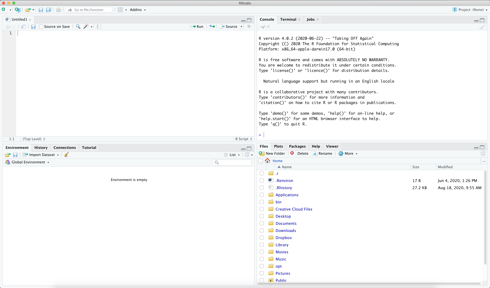

# 1. R ja RStudio

## R-ist üldiselt

Statistiline analüüs tähendab ühel või teisel viisil arvudega toimingute tegemist ning R
on programmeerimiskeel, mis on loodud just sellel eesmärgil. R-i õppimine tähendab, et
me peame selgeks saama teatud käsud ja nende ütlemise viisid, millega R teeb andmetega
just seda, mida me soovime.

Kindlasti on lihtsamaid viise statistika tegemiseks — näiteks programmid, kus saab käske
anda hiirenupu vajutustega, valides eelnevalt defineeritud toimingute hulgast. Kuid
sellised oskused ei vii kaugele. Nad ei aita sul teha oma tööd kiiresti ja korratavalt.

R on tasuta ja avatud tarkvara, millel on väga suur ja aktiivne kasutajate ning
arendajate kogukond. Sa võid kindel olla, et R-ga saab teha enamikke analüüse kõige
ajakohasematel viisidel. Ning isegi kui mõni tehnika on puudu — kuna tegemist on
programmeerimiskeelega, saab iga kasutaja selle ise juurde luua.

**Miks R?**

* R on tasuta.
* R on peaaegu piiramatult kohandatav.
* R-i on efektiivne ja kiire kasutada.
* R toimib **analüüsipäevikuna** — sinu kood on ühtlasi dokumentatsioon selle kohta,
  mida sa tegid.
* R võimaldab analüüside kiiret kordamist, täiendamist ja muutmist.
* R-i oskus on sageli statistikaga seotud töö saamise eeltingimus.

> Kõige olulisem neist on **analüüsipäevik**. Kui sa teed oma analüüsi hiireklõpsudega,
> siis kolme kuu pärast ei tea sa enam, mida sa täpselt tegid, ega oska seda korrata.
> Kui sa teed ta koodiga, siis on kõik kirjas. Samuti teeb see sinu analüüsi teistele
> läbipaistvaks - on võimalik samm-sammult näha, mida sa oma andmetega oled teinud
> ja kuidas oma tulemusteni jõudnud.

## RStudio

R on lihtsalt programmeerimiskeel. **RStudio** on programm, mis teeb R-ga töötamise
kiireks ja mugavaks. Ta pakub kasutajaliidese, kus on korraga aken, kuhu saab kirjutada
ja salvestada R-i käske, ning aken, kus näeb nende käskude väljundit. Lisaks teeb
RStudio lihtsaks andmete haldamise, jooniste kuvamise ja abi otsimise.

RStudio on samuti tasuta ning tal on palju laiendusi: R Markdown ja Quarto, ettekanded,
interaktiivsed veebilehed (Shiny) ja palju muud.

## R ja RStudio sinu arvutis

Sul on vaja installeerida **kaks** programmi.

* **R** ise:
  * [Windows](https://cloud.r-project.org/bin/windows/base/)
  * [macOS](https://cloud.r-project.org/bin/macosx/)
  * [Linux (Ubuntu)](https://cloud.r-project.org/bin/linux/ubuntu/)
* **RStudio**, mida arendab ettevõte Posit:
  [allalaadimine](https://posit.co/download/rstudio-desktop/)

> Kui sa oled R-i ja RStudio juba mõnda aega tagasi installeerinud, siis hoolitse selle
> eest, et nad oleks värskendatud. Vanade versioonidega tekib arusaamatuid probleeme,
> mida uuemas versioonis lihtsalt ei ole.

Kui sa avad RStudio, näeb ta umbes selline välja:

<center>
{width=95%}
</center>

## Projekt, mitte töökaust

Enne kui midagi kirjutama hakkame või pikemalt R-i ja RStudiosse süveneme, teeme 
ühe asja korralikult ära.

Iga analüüs peaks elama **omaenda kaustas** koos oma andmete, koodi ja tulemustega.
RStudios tehakse see nii, et luuakse **projekt**: `File → New Project → New Directory →
New Project`. Anna talle nimi (näiteks `statanal`) ja vali koht, kuhu ta läheb.

Mis siis juhtub? RStudio teeb kausta ja sinna sisse faili laiendiga `.Rproj`. Kui sa
edaspidi avad R-i selle faili kaudu, siis **teab R automaatselt, kus su asjad on.** Sa
saad viidata failidele nii: `"data/ess11_ee_raw.sav"` — ja see töötab.

> Vanemates materjalides ja vanemates R-i õpikutes õpetatakse töökausta määrama käsuga
> `setwd("C:/Users/marti/Desktop/...")`. **Pigem ära tee seda.** Selline rida töötab 
> ainult sinu arvutis. Kui sa saadad oma koodi kellelegi teisele — näiteks juhendajale 
> — siis tema arvutis ta ei tööta. Projekt lahendab selle probleemi ära.

Loo projekti sisse (projekti kausta) kaks alamkausta: `data` andmete jaoks ja `R` koodifailide jaoks.

Nüüd tekita uus koodifail: `File → New File → R Script`. Siia kirjutad sa käsud, mida R
peaks täitma.

> Oleks hea, kui sa kasutad kogu praktikumide vältel ühte sellist koodifaili, sest
> järgnevatel kordadel jätkame sealt, kus pooleli jäime.

## RStudioga töötamine

Konsool ja tekstiredaktor on RStudio kaks kõige olulisemat akent. Tekstiredaktoris
kirjutad koodi, konsoolis näed selle väljundit.

Mõned seaded, mis teevad elu lihtsamaks:

* `Tools → Global Options → Code → Editing → Soft wrap R source files` — tee siia
  linnuke. See hoiab pikad koodiread ekraani piires.
* `Tools → Global Options → Appearance` — vali endale sobiv välimus ja kirjasuurus.

Klahvikombinatsioonid (Windows, sulgudes macOS):

| Kombinatsioon | Mida teeb |
|---|---|
| **Ctrl+Enter** (Cmd+Enter) | jooksuta rida, kus kursor on |
| Ctrl+Shift+M (Cmd+Shift+M) | sisesta toru (peagi räägime pikemalt, mida see tähendab) |
| Ctrl+D (Cmd+D) | kustuta rida |
| Ctrl+I (Cmd+I) | korrasta koodi taandeid (aitab teha koodi ilusamaks ja loetavamaks) |
| Alt+Shift+K (Option+Shift+K) | näita kõiki kiirvalikuid |

**Mida R-i kohta teada:**

* R on **objektidele orienteeritud**. R-ga töötamine tähendab, et sa teed asju
  objektidega.
* Objekt on kogum informatsiooni, millel on nimi. Ta võib sisaldada üksikut väärtust,
  muutujat, tervet andmetabelit, mudeli tulemusi või joonist.
* Asjade tegemine tähendab, et sa **kasutad funktsioone**. Sa nimetad funktsiooni,
  nimetad objekti ja täpsustad, mida sellega teha.
* Tulemuse saad omakorda panna uude objekti.

## R keele põhifunktsioonid

### Kalkulaator

Kõige lihtsamal tasandil võib R-st mõelda kui kalkulaatorist. Sümbolid `+ - / *`
töötavad nii, nagu võiks oodata. Katusmärk `^` tõstab astmesse.

```{r}
#| label: kalkulaator
2 + 4 + 4
5 * 4
20 / 4
5^0.5   # astmesse 0.5 tõstmine on sama, mis ruutjuure võtmine
```

Märk `#` alustab **kommentaari**. R saab aru, et sellest märgist edasi ei ole enam
koodi, ja jätab ülejäänud rea vahele. Nii saab endale märkmeid jätta.

> Kommenteeri oma koodi. Sa kirjutad neid kommentaare iseendale kolme kuu pärast, kes ei
> mäleta sellest kõigest enam midagi. Või kui sa peaksid kunagi oma koodi jagama, siis on need juhised kellelegi teisele selle kohta, mida ja miks sa täpselt oled teinud. 

### Funktsioonid

Funktsioonid on käsud, mis teevad neile antud andmetega midagi. Grammatika on alati
sama: **esmalt funktsiooni nimi, siis sulgudes andmed** ning vajadusel täiendavad
argumendid, mis on omavahel komadega eraldatud ja millele antakse väärtus
võrdusmärgiga.

Näiteks funktsioon `log()` võtab arvust logaritmi. Ilma täiendavate argumentideta võtab
ta naturaallogaritmi; argumendiga `base` saab öelda, millise alusega logaritmi tahad.

```{r}
#| label: funktsioonid
log(10)
log(10, base = 10)
```

Abi saamiseks kirjuta funktsiooni nime ette küsimärk: `?log`. Sama teeb funktsioon
`help()`.

### Objektid

Objekti loomiseks kasutatakse märki `<-`, mida loetakse "saab väärtuseks".

```{r}
#| label: objektid
x1 <- 4 + 1
x1
```

Kui tahad näha, mis on objekti sees, kirjuta lihtsalt tema nimi. Töökeskkonnas olevaid
objekte näed RStudio aknas "Environment".

> R-is on kaks viisi väärtuse andmiseks: `<-` ja `=`. Kasuta objektide loomiseks alati
> `<-` ja jäta `=` funktsioonide argumentide jaoks. Nii on kohe näha, kumb on kumb.

#### Vektorid

Vektor on väärtuste jada, kus igal väärtusel on oma asukohanumber. Vektori tekitamiseks
kasuta funktsiooni `c()` (*combine*).

```{r}
#| label: vektorid
x1 <- c(x1, 2)
x1

x3 <- c(x1, 6, 9, 11, 15)
x3
```

Teatud toiminguid saab teha kõikide elementidega korraga.

```{r}
#| label: vektor-tehted
x3 / 3
x3 + 1
```

Vektori peal saab kasutada funktsioone, mis teevad midagi kõikide väärtustega korraga.
Mõned kõige sagedamini vajaminevad:

* `mean()` — aritmeetiline keskmine;
* `sum()` — kõikide väärtuste summa;
* `length()` — elementide arv;
* `round()` — ümardamine. Teine argument ütleb, mitu kohta pärast koma alles jätta.

```{r}
#| label: vektor-funktsioonid
mean(x3)
sum(x3)
length(x3)
round(mean(x3), 2)
```

Vektorid ei pea sisaldama ainult numbreid.

Funktsioon `class()` ütleb, mis tüüpi objektiga on tegemist. Seda funktsiooni läheb sul
väga tihti vaja — suur osa segastest veateadetest tuleb sellest, et objekt ei ole seda
tüüpi, mida sa arvasid.

```{r}
#| label: tekstivektor
rahvus <- c("eestlane", "prantslane", "sakslane", "prantslane", "soomlane")
rahvus
class(rahvus)
```

Siin on tegemist **tekstilise vektoriga**.

> **Jutumärkide reegel.** R keeles tähistavad jutumärgid tekstilisi andmeid. Ilma
> jutumärkideta viitad sa R-i käskudele ja töökeskkonnas olevatele objektidele. See vahe
> on oluline ja seda unustatakse pidevalt.

Kategoorilised muutujad on R-is tavaliselt salvestatud **faktoritena**.

> **Faktor** on R-i andmetüüp kategoorilise muutuja jaoks. Kategooriaid tähistavad
> arvulised väärtused ja igal kategoorial on oma silt.

Tekstilisest vektorist saab faktori funktsiooniga `factor()`. Faktori kategooriaid
näitab funktsioon `levels()`.

```{r}
#| label: faktor
rahvus <- factor(rahvus)
class(rahvus)
levels(rahvus)
```

Pane tähele, et kategooriad on vaikimisi tähestikulises järjekorras — see järjekord on hiljem
oluline nii joonistel kui mudelites. Vaatame hiljem ka seda, kuidas seda järjekorda muuta. 

Igal väärtusel on oma asukoht ehk **indeks**, millele saab viidata nurksulgudega.

```{r}
#| label: indeks
x3
x3[2]          # teisel kohal asuv väärtus
x3[2] <- 32    # asendamine
x3
```

#### Puuduvad väärtused

Puuduv väärtus on mõõtmine, mis ei andnud tulemust — näiteks kui küsitletav jättis
mõnele küsimusele vastamata. R tähistab neid tähepaariga `NA`.

```{r}
#| label: na
x3[1] <- NA
x3
mean(x3)
```

Vastus on `NA`. See ei ole viga — see on R, kes tuletab sulle meelde, et andmed on
puudulikud. Kui sa tahad puuduvad väärtused arvutusest välja jätta, pead seda **eraldi
ütlema** argumendiga `na.rm = TRUE`.

```{r}
#| label: na-rm
mean(x3, na.rm = TRUE)
```

Funktsioon `na.omit()` eemaldab puuduvad väärtused.

```{r}
#| label: na-omit
na.omit(x3)
```

> Pane tähele: `na.omit()` **ei muuda** objekti sisu, ta ainult kuvab tulemuse. Kui
> tahad muudatust alles hoida, pead ta uude objekti panema.

#### Andmetabelid

Andmetabel (*data frame*) sisaldab mitut sama pikkusega vektorit, mis võivad olla
erinevat tüüpi. See on kõige tüüpilisem andmeformaat.

Andmetabeli loomiseks on funktsioon `data.frame()`. Iga argument on üks veerg ning
argumendi nimi saab veeru nimeks.

```{r}
#| label: data-frame
vanus <- c(34, 51, 28, 45, 62)
data1 <- data.frame(rahvus = rahvus, vanus = vanus)
data1
```

Andmetabel on **kahemõõtmeline**: tal on read ja veerud. Tavaliselt on andmed struktureeritud nii - read on juhtumid, veerud on muutujad.

Veergude nimesid saab vaadata ja muuta funktsiooniga `names()`.

```{r}
#| label: names
names(data1)
```

Andmete kätte saamiseks andmetabelist tuleb viidata **kahele** indeksile: esmalt reale, siis veerule.

```{r}
#| label: data-indeks
data1[2, 1]   # teine rida, esimene veerg
data1[, 1]    # kogu esimene veerg
data1[2, ]    # kogu teine rida
```

> **Kõigepealt read, siis veerud.** Read on esimene mõõde, veerud teine. Jäta see meelde
> — sa kasutad seda pidevalt.

Veerule saab viidata ka dollarimärgiga, kasutades veeru nimetust (andmetabelis on tavaliselt veergudel - muutujatel - nimed). 

```{r}
#| label: dollar
data1$vanus
```

#### Nimekirjad

Nimekiri (*list*) on samuti andmete jada, kuid iga element võib olla erinevat laadi
andmestruktuur — üksik väärtus, vektor või terve andmetabel. Nimekirja loomiseks on
funktsioon `list()`, mis töötab nagu `c()`, ainult et ei nõua elementidelt ühesugust
tüüpi.

```{r}
#| label: list
nimek <- list(10, x3, data1)
```

Elementidele viitamiseks kasuta **topelt** nurksulge.

```{r}
#| label: list-indeks
nimek[[1]]
```

> Nimekirju sa ise eriti tegema ei hakka, aga sa kohtad neid pidevalt: näiteks **mudelite
> tulemused on R-is nimekirjad.** Sellepärast on kasulik teada, kuidas nad käituvad.

## Paketid

R tuleb suure hulga baasfunktsionaalsusega, millest paljude analüüside jaoks ei piisa.
R-l on aga tuhandeid **lisapakette**, mis tema võimalusi laiendavad.

Paketi paigaldamiseks kasuta `install.packages()` — paketi nimi käib **jutumärkides**.

```{r}
#| label: install
#| eval: false
install.packages("ggplot2")
```

Paigaldatud paketi laadimiseks kasuta `library()` — siin **ilma** jutumärkideta.

```{r}
#| label: library
#| eval: false
library(ggplot2)
```

> Paigaldama pead sa paketi **üks kord**. Laadima pead sa ta **iga kord**, kui sa R-i
> uuesti avad. Seetõttu käivad `library()` käsud koodifaili algusesse ja
> `install.packages()` käske koodifailis üldiselt ei hoita.

## Kuidas koodi struktureerida

Koodifail võiks olla üles ehitatud alati ühtemoodi. "Majapidamistööd" — pakettide
laadimine ja andmete sisse lugemine — käivad faili algusesse.

Järgnev näide on mõeldud ainult **kuju** näitamiseks. Andmete laadimise funktsiooniga
`load()` tegeleme järgmises praktikumis — praegu vaata lihtsalt, mis järjekorras asjad
failis olema peaksid.

```{r}
#| label: struktuur
#| eval: false
# Pakettide laadimine
library(haven)
library(dplyr)
library(ggplot2)

# Andmete laadimine
load("data/ess11_ee_clean.rdata")

# Andmehaldus

# Analüüsid

# Joonised
```

Suuremate tööde puhul jaga oma töö mitme faili vahel: ühes tegeled andmetega, teises
analüüsidega, kolmandas joonistega. Just nii on üles ehitatud ka need materjalid.

## Kust leida abi

* Funktsioon `help()` või küsimärk funktsiooni nime ees, näiteks `?mean`.
* Pakettide dokumentatsioon.
* Guugeldamine — kirjuta otsingusse "R", funktsiooni nimi ja probleemi kirjeldus.
* Foorum Moodle'is.
* Kiri: [martin.molder@ut.ee](mailto:martin.molder@ut.ee)

### Tehisintellekti kasutamisest

Suured keelemudelid — ChatGPT, Claude, Copilot, Gemini — oskavad R-i hästi. Nad on abiks
siis, kui sul on **konkreetne ja piiritletud** probleem:

* mida see veateade tähendab?
* kuidas ma selle joonise telje sildid ümber pööran?
* mis on selles koodireas valesti?
* kirjuta see kood ümber nii, et ta oleks loetavam.

Selles on nad head ja seda tasub ka vajadusel kasutada.

> **Aga miks ei ole see hea esimene kokkupuude statistilise kodeerimisega?**
>
> Sellepärast, et keelemudel annab sulle **usutava koodi ka siis, kui see analüüs on
> sinu andmete jaoks vale.** Ta ei tea, mis skaalal su muutuja on. Ta ei tea, et sa
> arvutad keskmist muutujast, kus osa väärtusi tähendab tegelikult "ei oska öelda". Ta
> ei tea, et su mudelist kadus vaikselt kolmandik juhtumitest.
>
> Kood jookseb läbi. Tuleb arv. Arv on vale.
>
> Sa ei suuda seda märgata enne, kui sa oskad koodi **ise lugeda** ja tead, mida see
> analüüs eeldab. Just seda me sellel kursusel ehitamegi. Kui vundament on olemas, siis
> on keelemudel suurepärane tööriist, mis säästab sulle tunde. Enne seda on ta masin,
> mis toodab enesekindlalt esitatud vigu või analüüse, mis ei ole päris sellised nagu nad olema peaksid. 
> Kui sul endal teadmised puuduvad, siis ei ole sa võimeline ka keelemudeli tulemusi hindama. Sa oled pimesi temast sõltuv ja sinu enda teadmised ja oskused ei arene. Kui kõik kood ja kogu analüüsiloogika aga ise läbi mõelda, siis oled sa keelemudelile võrdsem vesltuspartner ning oled võimeline looma koostöö, mis ka sind ennast arendab ja mis aitab sul teha paremaid analüüse. 

Tartu Ülikoolil on tehisintellekti kasutamise kohta õppetöös eraldi suunis, millega
tasub tutvuda: [suunis tehisintellekti
kasutamiseks](https://ut.ee/et/sisu/suunis-tehisintellekti-kasutamiseks-oppetoos).
Materjalid on koondatud ka lehele [Tehisintellekt Tartu
Ülikoolis](https://sisu.ut.ee/ti/materjalid/).

Kõige olulisem reegel sealt: **tehisintellekti loodud teksti esitamine oma nime all on
akadeemiline petturlus.** Koodi puhul on mõistlik lähtuda samast põhimõttest, mis
igasuguse abi puhul — sa pead aru saama sellest, mida sa esitad, ja suutma seda
selgitada.

## Harjutused

::: {.harjutus}
**1. Vektorid ja funktsioonid.** Tee vektor, kus on viie inimese vanused. Arvuta nende keskmine, summa ja standardhälve. Seejärel asenda üks vanus puuduva väärtusega `NA` ja arvuta keskmine uuesti — kõigepealt ilma argumendita `na.rm`, siis koos temaga.

**2. Andmetabel.** Tee andmetabel, kus on kaks muutujat: nimi ja vanus, viie inimese kohta. Küsi sealt välja kolmanda inimese vanus. Seejärel küsi välja kogu vanuse veerg kahel eri viisil — nurksulgudega ja dollarimärgiga.

**3. Faktor.** Tee tekstiline vektor viie inimese elukohatüübiga (linn või maa) ja muuda ta faktoriks. Mis järjekorras on kategooriad ja miks?
:::
